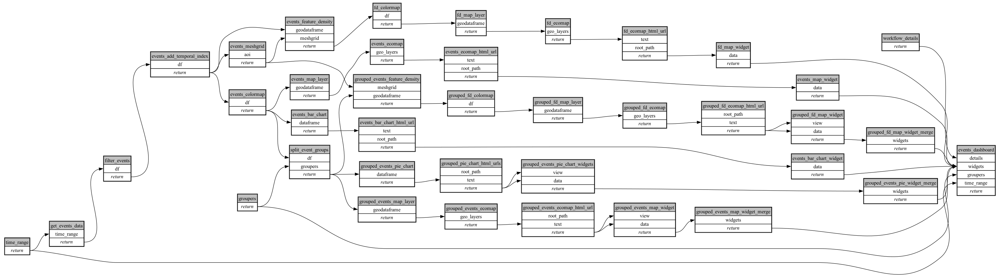

```
# [generated]
# by = { compiler = "ecoscope-workflows-core", version = "9999" }
# from-spec-sha256 = "38ed8e3ac69cd7649e9c517bb5be8b37687fcf049413755f7bc8ad42ff0b2cc9"

```
# ecoscope-workflows-events-workflow


