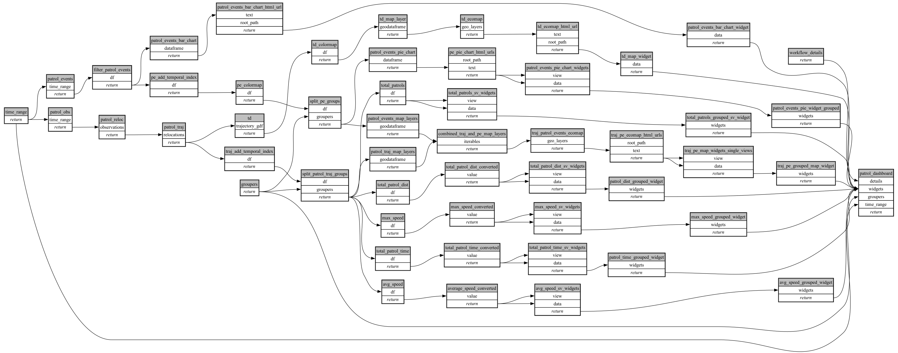

```
# [generated]
# by = { compiler = "ecoscope-workflows-core", version = "9999" }
# from-spec-sha256 = "4382bec97e4637434433df6a84925c68921ba6c1d49dd2955b1dfcb2a328ea4b"

```
# ecoscope-workflows-patrols-workflow


