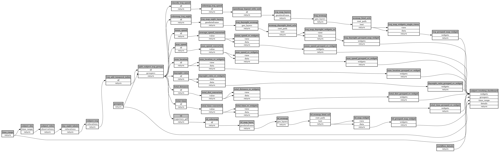

```
# [generated]
# by = { compiler = "ecoscope-workflows-core", version = "9999" }
# from-spec-sha256 = "00d8c9580f2a24ef3fda767e8e8886ba9c48337c73bb8b07fd7ed5a628eef24f"

```
# ecoscope-workflows-subject-tracking-workflow


