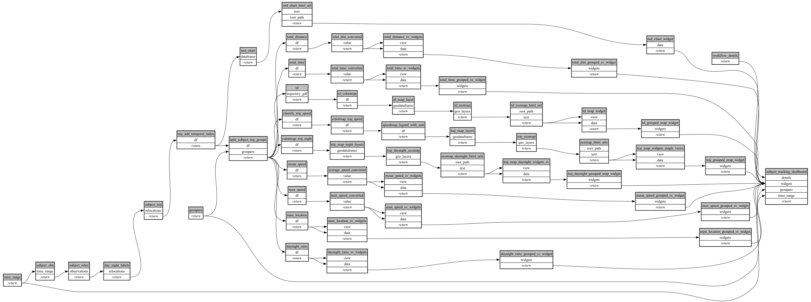

```
# [generated]
# by = { compiler = "ecoscope-workflows-core", version = "9999" }
# from-spec-sha256 = "71942219c2ad314fb88fdc036bcbbd47f07aa1c5724911f9757ac0ec52b96089"

```
# ecoscope-workflows-subject-tracking-workflow


